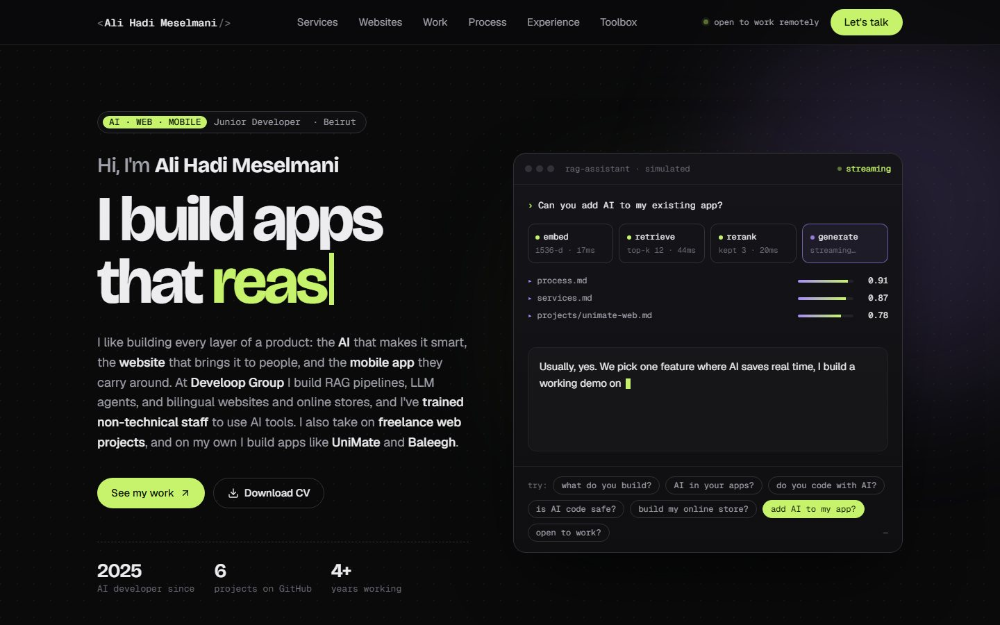
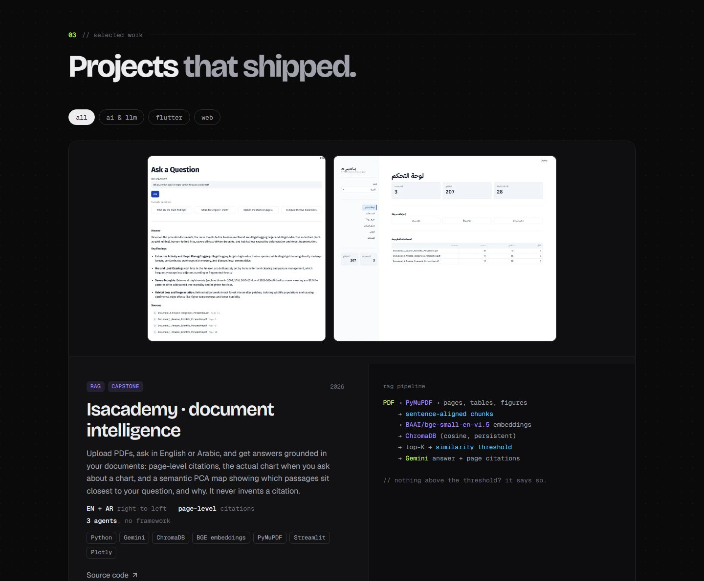
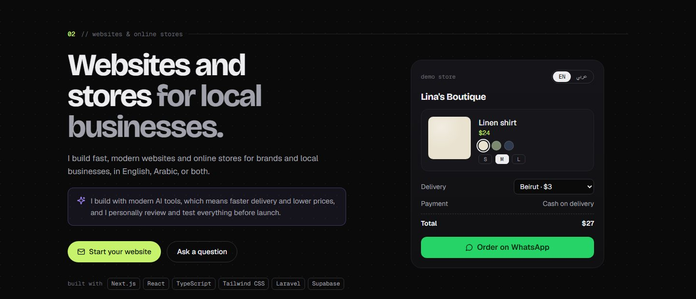
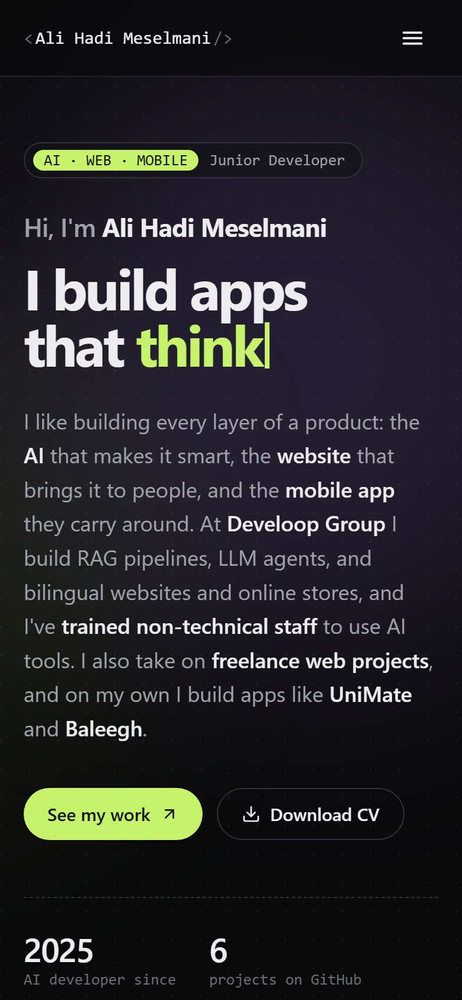
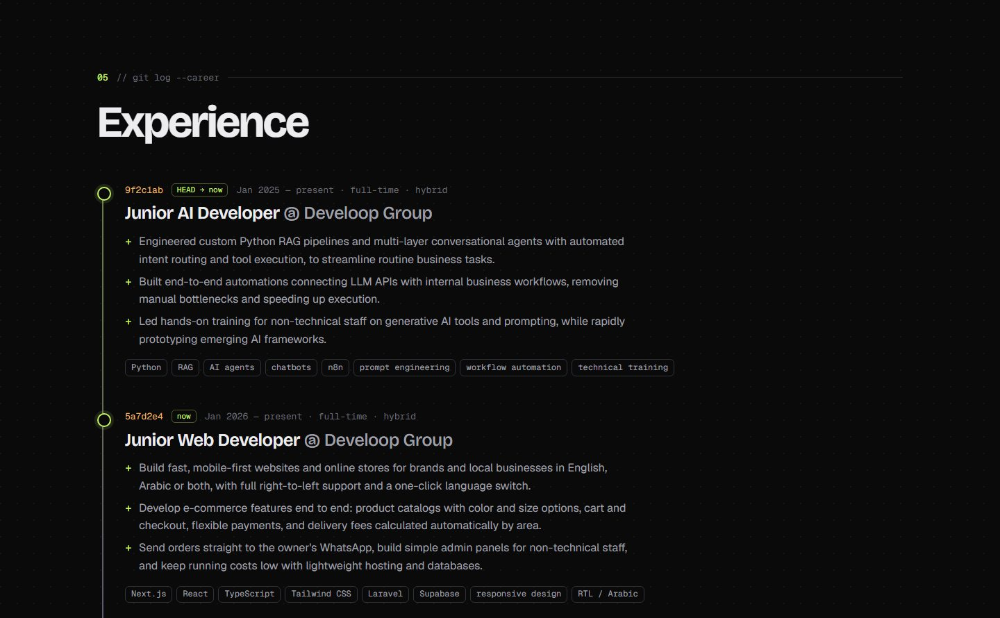

# Ali Hadi Meselmani · Portfolio

**Live site: [ali-hadi-meselmani.vercel.app](https://ali-hadi-meselmani.vercel.app)**



Personal portfolio of a junior **AI, web and mobile developer** in Beirut: RAG pipelines and LLM agents, bilingual websites and online stores, and Flutter apps.

## What's inside

- **Simulated RAG assistant** in the hero: each question walks through *embed → retrieve → rerank → generate* and streams a scripted answer, with the "retrieved sources" and their scores. It is clearly labelled as simulated.
- **Websites & online stores** section with a working **demo store**: switch between English and Arabic (full right-to-left), pick a color and size, and see the delivery fee change by area.
- **Projects** with real screenshots, a filter (AI & LLM / Flutter / Web), and a **"More on GitHub"** list that loads my public repositories live from the GitHub API, so new repos appear without editing the page.
- **Experience** styled as a `git log`, plus certifications and community events.
- **Link preview card** (Open Graph / Twitter), structured data for search engines, `robots.txt` and `sitemap.xml`.

## Screenshots

| Projects | Demo store (EN ⇄ AR) | Mobile |
|---|---|---|
|  |  |  |



## Built with

Plain **HTML, CSS and JavaScript** (`index.html`, `styles.css`, `script.js`): no framework and no build step.

- Fonts: Bricolage Grotesque, Geist and Geist Mono, self-hosted in `fonts/` (SIL Open Font License)
- Icons: [Lucide](https://lucide.dev) (ISC License), inlined as SVG
- Hosting: [Vercel](https://vercel.com), deployed with the Vercel CLI

## Run it locally

```bash
python -m http.server 5500
```

Then open <http://localhost:5500>. A local server behaves like the live site; opening `index.html` directly also works.

## Project structure

```
index.html                  page content and structure
styles.css                  all styles, including the font setup
script.js                   demo, store, filters, GitHub list, menu and scroll effects
Ali_Hadi_Meselmani_CV.pdf   downloadable CV
vercel.json                 redirects the old /cv.pdf link to the CV
img/                        project screenshots and the link preview image (og.jpg)
fonts/                      self-hosted web fonts
robots.txt                  search engine rules
sitemap.xml                 page list for search engines
docs/screenshots/           images used in this README (not deployed)
```

## Contact

[meselmanialihadi@gmail.com](mailto:meselmanialihadi@gmail.com) · [LinkedIn](https://www.linkedin.com/in/alihadimeselmani/) · [GitHub](https://github.com/AliHadi315)

---

© Ali Hadi Meselmani. The site's text, CV and screenshots are personal content; please don't reuse them without asking.
